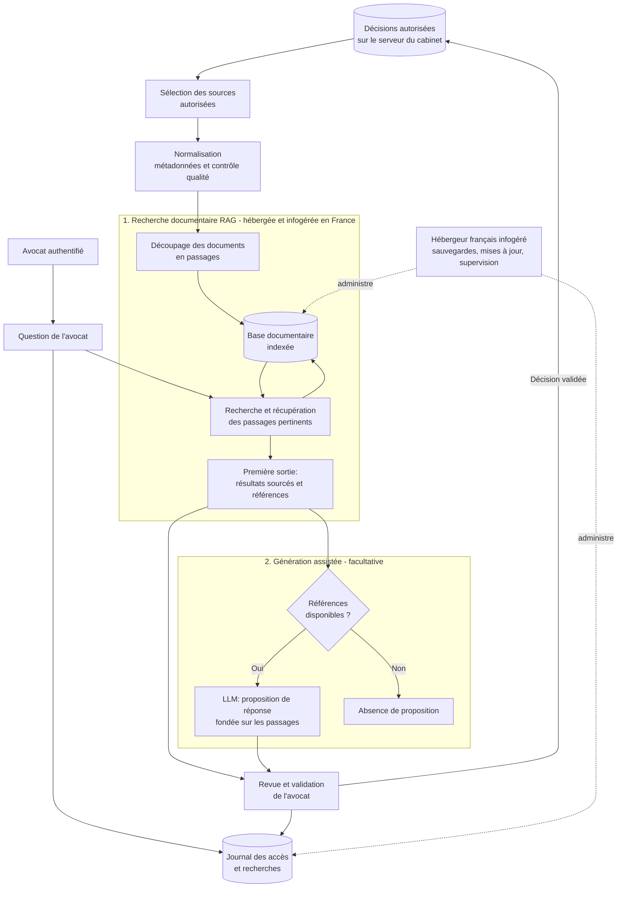

# Schéma d'architecture cible

```mermaid
flowchart TD
    SRC[(Décisions autorisées<br/>sur le serveur du cabinet)]
    SEL[Sélection des sources<br/>autorisées]
    NORM[Normalisation<br/>métadonnées et contrôle qualité]

    USER[Avocat authentifié]
    QUERY[Question de l'avocat]
    REVIEW[Revue et validation<br/>de l'avocat]
    LOG[(Journal des accès<br/>et recherches)]
    HOST[Hébergeur français infogéré<br/>sauvegardes, mises à jour, supervision]

    subgraph SEARCH_SYSTEM["1. Recherche documentaire RAG - hébergée et infogérée en France"]
        CHUNK[Découpage des documents<br/>en passages]
        IDX[(Base documentaire<br/>indexée)]
        RETRIEVE[Recherche et récupération<br/>des passages pertinents]
        SOURCED[Première sortie:<br/>résultats sourcés et références]
    end

    subgraph GENERATION["2. Génération assistée - facultative"]
        CHECK{Références<br/>disponibles ?}
        LLM[LLM: proposition de réponse<br/>fondée sur les passages]
        NORESULT[Absence de proposition]
    end

    SRC --> SEL --> NORM --> CHUNK --> IDX
    USER --> QUERY --> RETRIEVE
    RETRIEVE --> IDX
    IDX --> RETRIEVE
    RETRIEVE --> SOURCED
    SOURCED --> REVIEW
    SOURCED --> CHECK
    CHECK -->|Oui| LLM --> REVIEW
    CHECK -->|Non| NORESULT
    REVIEW -->|Décision validée| SRC
    QUERY --> LOG
    REVIEW --> LOG

    HOST -. administre .-> IDX
    HOST -. administre .-> LOG
```